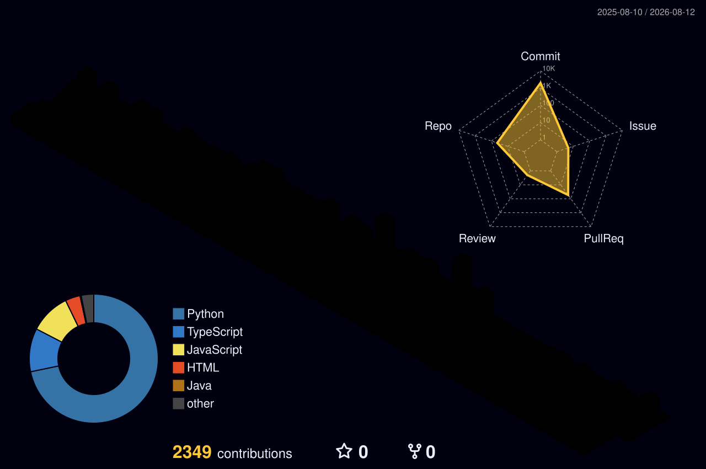

  

---

  

### Just a real dude who loves writing code, breaking things, fixing them at 3am, and pushing commits nobody asked for.

### I'm **Rajkaran** — a developer from **India** who genuinely enjoys building software.

### I'm not the **"I know everything"** type. I Google stuff daily. Stack Overflow is my second home. But I learn fast, ship faster, and I don't give up on bugs easily.

---

##  GitHub Contributions
---

 

---

---

##  Contribution Activity

<picture>
  <source media="(prefers-color-scheme: dark)" srcset="./profile/github-snake-dark.svg" />
  <source media="(prefers-color-scheme: light)" srcset="./profile/github-snake.svg" />
  
</picture>

---

##  What I Build

**Backend Systems • Microservices • REST APIs • Distributed Systems • AI/LLM Applications • Data Platforms • Full-Stack Products**

---

---

  
  

---

  

